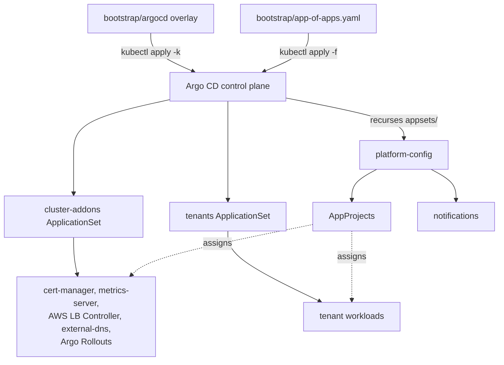
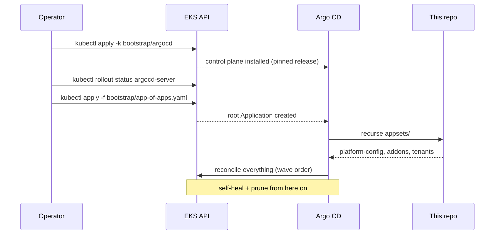

# gitops-argocd-platform

GitOps control plane for Amazon EKS built on [Argo CD](https://argo-cd.readthedocs.io/):
a declarative, pinned Argo CD installation, an app-of-apps root that owns everything
else in the cluster, ApplicationSets for cluster addons and tenant workloads, and
progressive delivery with Argo Rollouts.

Git is the single source of truth. After the one-time bootstrap below, no manual
`kubectl apply` should ever mutate the cluster — every change lands as a commit,
Argo CD reconciles it, and drift is corrected automatically.

## Architecture

A single root Application expands into the full cluster state: it owns the
platform-configuration Applications (AppProjects, notifications) and the
ApplicationSets that stamp out cluster addons and per-tenant workloads.



See [docs/architecture.md](docs/architecture.md) for the full design, sync-wave
ordering, and blast-radius model.

## Repository layout

| Path | Purpose |
|------|---------|
| `bootstrap/argocd/` | Kustomize overlay that installs a pinned Argo CD release with EKS-specific patches |
| `bootstrap/app-of-apps.yaml` | Root Application — the only manifest ever applied by hand |
| `appsets/` | ApplicationSets that stamp out cluster addons and per-tenant applications |
| `tenants/` | Tenant registrations (`config.json`) and workload manifests discovered by the tenants ApplicationSet |
| `apps/` | Workload manifests, including canary Rollouts and analysis templates |
| `projects/` | AppProjects with RBAC boundaries and sync-wave ordering |
| `notifications/` | Argo CD notifications configuration (delivery to chat/webhooks) |
| `tests/` | Policy checks for sync-wave annotations and resource limits |
| `docs/` | Architecture and tenant onboarding guides |

## Prerequisites

- An EKS cluster (1.29+) and a kubeconfig context pointing at it
- `kubectl` 1.29+ (`kubectl apply -k` provides the kustomize support used here)
- Cluster-admin access for the initial bootstrap only
- Optional for local validation: `kustomize`, `kubeconform`, `yamllint`, `python3`

## Bootstrap flow

The bootstrap is three commands, run once. After the third, Git drives the cluster.



```bash
# 1. Install Argo CD (namespace, pinned upstream manifest, EKS patches)
kubectl apply -k bootstrap/argocd

# 2. Wait for the control plane to become ready
kubectl -n argocd rollout status deployment/argocd-server --timeout=300s

# 3. Hand the cluster over to GitOps — the root app adopts everything under appsets/
kubectl apply -f bootstrap/app-of-apps.yaml
```

Or use the Makefile: `make bootstrap` runs all three steps in order.

Retrieve the initial admin password (rotate it immediately, then delete the secret):

```bash
kubectl -n argocd get secret argocd-initial-admin-secret \
  -o jsonpath='{.data.password}' | base64 -d; echo
```

## Onboarding a tenant

Adding a team is a pull request — no cluster access required. Create
`tenants/<name>/config.json` and drop the workload manifests in the adjacent
`manifests/` directory; the tenants ApplicationSet discovers it and Argo CD
creates the Application on merge. Full walkthrough and policy requirements in
[docs/tenant-onboarding.md](docs/tenant-onboarding.md).

## Validation

Before committing, validate manifests locally:

```bash
make validate   # yamllint + kustomize build + kubeconform + policy checks
make diff       # server-side diff of the bootstrap overlay against the cluster
```

The same checks run in CI on every pull request.

## Version pinning

The Argo CD version is pinned to an exact upstream release tag inside
`bootstrap/argocd/kustomization.yaml`, and every addon Helm chart is pinned to an
immutable chart version. Upgrades are a one-line diff: bump the tag, open a pull
request, and let the manifest validation confirm the build before merging. Never
track a moving branch.

## Design principles

- **Declarative everything** — the bootstrap overlay and the root Application are
  the only objects created imperatively, exactly once.
- **App-of-apps** — a single root Application owns the ApplicationSets, which in
  turn own addons and tenant apps; deleting the root cascades cleanly via finalizers.
- **Pinned supply chain** — upstream manifests are referenced by immutable release
  tag, never `HEAD` or `stable`.
- **Self-healing** — automated sync with prune and self-heal keeps the cluster
  converged with Git; out-of-band changes are reverted.
- **Blast-radius control** — AppProjects restrict which repos, clusters, and
  namespaces each team can deploy to; sync waves order addons before workloads.

## Documentation

- [docs/architecture.md](docs/architecture.md) — full architecture, sync-wave
  ordering, AppProject boundaries, progressive delivery, and design decisions.
- [docs/tenant-onboarding.md](docs/tenant-onboarding.md) — registering a tenant,
  workload requirements, project boundaries, and offboarding.

## Contributing

Open a Discussion in the repo or comment on a pull request.

## License

MIT — see [LICENSE](LICENSE).
