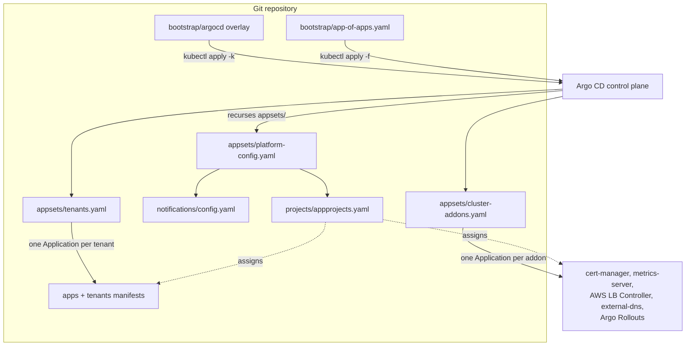

# Architecture

This platform turns an Amazon EKS cluster into a fully declarative, self-healing
GitOps system built on Argo CD. Git is the single source of truth: after a
one-time bootstrap, the cluster's entire desired state — the Argo CD control
plane itself, cluster addons, platform configuration, and every tenant
workload — is described by manifests in this repository and reconciled
continuously.

## Control flow at a glance

## Layered ownership

The design is an **app-of-apps**: a single root Application owns a small set of
ApplicationSets, which in turn own everything else. Ownership flows downward so
that a single hand-applied manifest expands into the full cluster state.

1. **Bootstrap overlay** (`bootstrap/argocd/`) — a Kustomize overlay that installs
   a pinned upstream Argo CD release into the `argocd` namespace, with
   EKS-specific patches (TLS terminated at the load balancer, tuned reconciliation
   timeout, explicit resource requests and limits on the server, repo-server, and
   application-controller). Applied exactly once with `kubectl apply -k`.

2. **Root Application** (`bootstrap/app-of-apps.yaml`) — the only manifest applied
   by hand after Argo CD is up. It points Argo CD back at this repository's
   `appsets/` directory and recurses it, so every ApplicationSet and platform
   Application committed there is adopted automatically. From this point on, no
   manual `kubectl apply` should ever mutate the cluster.

3. **Platform configuration** (`appsets/platform-config.yaml`) — two Applications
   that install the state which must exist before workloads reconcile: the
   AppProjects (`projects/`) and the notifications configuration
   (`notifications/`). Managing these through Argo CD keeps them self-healing and
   avoids applying a custom resource in the same pass that installs its CRD.

4. **Cluster addons** (`appsets/cluster-addons.yaml`) — an ApplicationSet with a
   list generator that stamps out one Application per curated platform addon
   (certificate management, metrics, ingress, DNS, progressive-delivery
   controller). Each addon is an upstream Helm chart referenced by an immutable
   chart version.

5. **Tenant applications** (`appsets/tenants.yaml`) — an ApplicationSet with a Git
   file generator that discovers tenants from `tenants/*/config.json`. Adding a
   tenant is a pull request that adds a directory; no controller access and no
   Argo CD configuration change is required.

## Sync-wave ordering

Resources are ordered with the `argocd.argoproj.io/sync-wave` annotation so that
providers land before consumers whenever a parent replays its children in wave
order:

| Wave | Resource | Rationale |
|------|----------|-----------|
| `-20` | AppProjects | Projects must exist before any Application names them |
| `-19` | Notifications config | Delivery configured early, still ahead of workloads |
| `-10` | Root Application | Reconciles before anything it creates |
| `0` | cert-manager, metrics-server | CRD providers and base controllers first |
| `10` | AWS Load Balancer Controller, external-dns | Depend on the base layer |
| `20` | Argo Rollouts | Controller lands before any Rollout resources |
| `30` | Tenant workloads | After all cluster addons are available |
| `40` | Sample Rollout | After the Rollouts controller and its CRDs |

## Blast-radius control with AppProjects

Two AppProjects (`projects/appprojects.yaml`) bound what each class of Application
may do:

- **platform-addons** — trusted cluster-wide components. Source repos are limited
  to this repository plus the curated upstream chart repositories; destinations
  are the addons' own namespaces; the cluster-scoped resource allow-list is open
  because these components legitimately manage CRDs, webhooks, and ClusterRoles.
- **tenants** — application teams. Confined away from the control plane
  (destination namespaces exclude `argocd`, `kube-system`, and the addon
  namespaces), forbidden from creating any cluster-scoped resource, and blocked
  from managing `ResourceQuota` and `LimitRange`. Project roles attach RBAC so a
  team can sync its own Applications without touching anyone else's.

## Progressive delivery

Workloads that opt into gradual rollout use Argo Rollouts (`apps/sample/`). A new
version is shifted in by traffic weight in steps; between steps, an
`AnalysisTemplate` queries Prometheus for success rate and p95 latency and the
release advances only while the canary stays healthy — otherwise it aborts and
rolls back automatically. Two Services (`-stable` and `-canary`) back the
strategy, and Argo Rollouts injects the per-revision pod-template-hash into each
Service selector at runtime.

## Self-healing and drift correction

Every Application syncs with `automated.prune` and `automated.selfHeal` enabled.
Resources deleted from Git are pruned from the cluster; out-of-band edits made
directly against the cluster are reverted to match Git. `ServerSideApply` and
`CreateNamespace` are set so that CRDs, namespaces, and the resources that depend
on them converge in a single pass, and a bounded retry with exponential backoff
absorbs transient reconciliation failures.

## Supply-chain pinning

Nothing tracks a moving target. The Argo CD release is pinned to an exact upstream
tag in the bootstrap overlay, and every addon Helm chart is pinned to an immutable
chart version. An upgrade is a one-line diff reviewed in a pull request, gated by
the manifest-validation checks before merge.

## Design decisions

- **List generator for addons, file generator for tenants.** Addons are few,
  curated, and change rarely, so an explicit allow-list is clearer and safer than
  filesystem discovery. Tenants are many and self-service, so directory discovery
  scales without controller changes.
- **Projects managed through GitOps, not the bootstrap overlay.** Keeping the
  AppProjects in an Argo CD Application makes them self-healing and sidesteps the
  CRD-before-custom-resource race that applying them alongside the install would
  create.
- **Secrets never in Git.** The notifications Slack token is referenced as
  `$slack-token` and supplied at runtime through the notifications secret (for
  example via External Secrets); no credential is committed.
